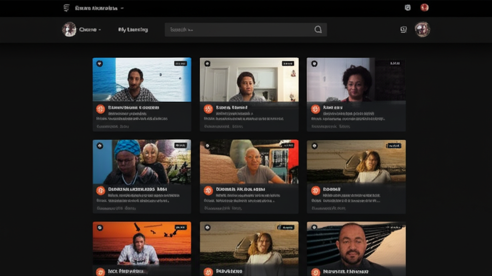

# LetPhil - Lessons

A modern web application for organizing and sharing educational video lessons. This platform allows teachers to showcase their video content organized by categories, making it easy for students to find and watch educational content.

## Table of Contents

- [Features](#features)
- [Getting Started](#getting-started)
  - [Installation](#installation)
  - [Running the Application](#running-the-application)
- [Updating Content](#updating-content)
  - [Adding or Updating Teachers](#adding-or-updating-teachers)
  - [Adding or Updating Videos](#adding-or-updating-videos)
- [Using the Application](#using-the-application)
- [Project Structure](#project-structure)
- [Customization](#customization)
- [Technologies Used](#technologies-used)

## Features

- Browse videos by date (newest first) on the home page
- View videos organized by categories
- Browse teachers and their video collections
- Watch videos directly from YouTube or local files
- Access GitHub repositories for code examples
- Responsive design that works on desktop and mobile devices
- Dark mode support
- Scroll-to-top functionality for easy navigation

## Getting Started

### Installation

1. Clone the repository:
   \`\`\`bash
   git clone https://github.com/your-username/letphil-lessons.git
   cd letphil-lessons
   \`\`\`

2. Install dependencies:
   \`\`\`bash
   npm install
   # or
   yarn install
   # or
   pnpm install
   \`\`\`

### Running the Application

1. Start the development server:
   \`\`\`bash
   npm run dev

   # or

   yarn dev

   # or

   pnpm dev
   \`\`\`

2. Open [http://localhost:3000](http://localhost:3000) in your browser to see the application.

## Updating Content

All content for the application is stored in the `lib/data.ts` file. This file contains arrays of teachers and videos that you can modify to update the content displayed in the application.

### Adding or Updating Teachers

To add or update teachers, modify the `teachers` array in `lib/data.ts`:

\`\`\`typescript
// Example of adding a new teacher
const teachers: Teacher[] = [
// Existing teachers...
{
id: "new-teacher", // Unique ID (used in URLs)
name: "New Teacher Name",
avatar: "/path-to-avatar-image.png", // Place image in public folder
},
];
\`\`\`

**Teacher Properties:**

- `id`: Unique identifier for the teacher (used in URLs, should be URL-friendly)
- `name`: The teacher's display name
- `avatar`: Path to the teacher's avatar image (stored in the public folder)

### Adding or Updating Videos

To add or update videos, modify the `videos` array in `lib/data.ts`:

\`\`\`typescript
// Example of adding a new video
const videos: Video[] = [
// Existing videos...
{
id: "new-video-id", // Unique ID
title: "Video Title",
date: "2023-12-15", // Format: YYYY-MM-DD
videoUrl: "https://www.youtube.com/watch?v=VIDEO_ID", // YouTube URL or local file path
category: "JavaScript", // Category name (HTML, CSS, JavaScript, React, etc.)
teacherId: "teacher-id", // Must match an existing teacher ID
description: "Description of the video content",
githubUrl: "https://github.com/username/repository", // Optional GitHub repository URL
},
];
\`\`\`

**Video Properties:**

- `id`: Unique identifier for the video
- `title`: The title of the video
- `date`: Release date in YYYY-MM-DD format
- `videoUrl`: URL to the video (YouTube or local file path)
- `category`: Category name (used for grouping videos)
- `teacherId`: ID of the teacher who created the video (must match an existing teacher ID)
- `description`: Brief description of the video content
- `githubUrl`: (Optional) URL to the GitHub repository with code examples

## Using the Application

### Home Page

The home page displays all videos sorted by date (newest first). Each video card shows:

- Thumbnail image
- Title and date
- Category badge
- Teacher avatar
- GitHub repository link (if available)
- "Watch Video" button

### Categories Page

The Categories page organizes videos by their category (HTML, CSS, JavaScript, React, etc.). Users can:

- Click on category tabs to view videos in that category
- See all videos within each category
- Click on teacher avatars to view all videos by that teacher

### Teachers Page

The Teachers page displays all teachers. Users can:

- View all teachers with their avatars
- Click on a teacher to see all their videos
- Browse a teacher's videos organized by category

### Video Playback

When a user clicks "Watch Video":

- YouTube videos open in a new tab on YouTube
- Local videos play directly in the browser

### GitHub Integration

If a video has an associated GitHub repository:

- A GitHub icon appears next to the teacher avatar
- Clicking the icon opens the repository in a new tab

## Project Structure

\`\`\`
letphil-lessons/
├── app/ # Next.js App Router
│ ├── categories/ # Categories page
│ ├── teachers/ # Teachers pages
│ ├── layout.tsx # Root layout
│ ├── page.tsx # Home page
│ └── globals.css # Global styles
├── components/ # React components
│ ├── ui/ # UI components (shadcn/ui)
│ ├── loading-indicator.tsx
│ ├── navigation.tsx
│ ├── scroll-to-top.tsx
│ ├── theme-provider.tsx
│ └── video-card.tsx
├── lib/ # Utility functions and data
│ ├── data.ts # Teacher and video data
│ ├── types.ts # TypeScript interfaces
│ └── utils.ts # Utility functions
├── public/ # Static assets
└── README.md # This file
\`\`\`

## Customization

### Changing the Theme

The application uses Tailwind CSS for styling. You can customize the theme by modifying:

- `tailwind.config.ts` - For color schemes and other Tailwind settings
- `app/globals.css` - For global CSS styles

### Adding New Categories

To add a new category:

1. Add videos with the new category name in `lib/data.ts`
2. Update the `getCategoryColor` function in `components/video-card.tsx` to include a color for your new category

\`\`\`typescript
const getCategoryColor = (category: string) => {
switch (category.toLowerCase()) {
// Existing categories...
case "new-category":
return "bg-purple-100 text-purple-800 hover:bg-purple-200 dark:bg-purple-800/70 dark:text-purple-100";
default:
return "bg-slate-100 text-slate-800 hover:bg-slate-200 dark:bg-slate-700 dark:text-slate-100";
}
}
\`\`\`

## Technologies Used

- [Next.js](https://nextjs.org/) - React framework
- [React](https://reactjs.org/) - UI library
- [TypeScript](https://www.typescriptlang.org/) - Type-safe JavaScript
- [Tailwind CSS](https://tailwindcss.com/) - Utility-first CSS framework
- [shadcn/ui](https://ui.shadcn.com/) - UI component library
- [Lucide React](https://lucide.dev/) - Icon library
